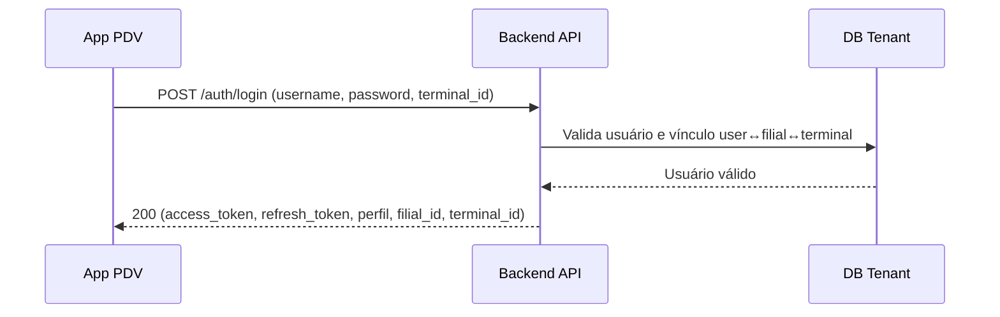
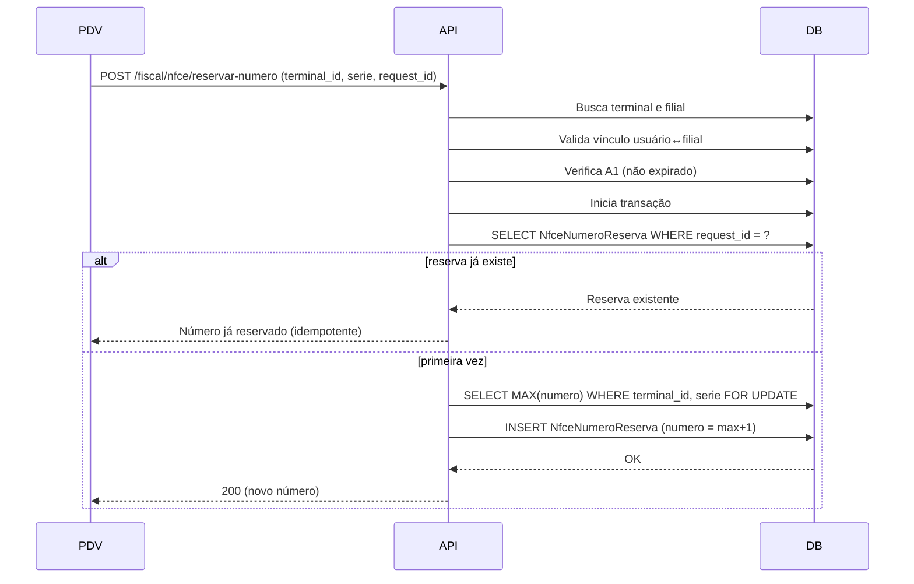
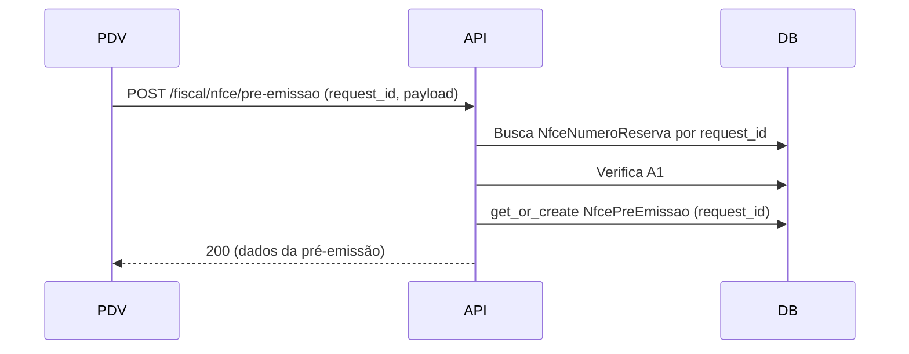
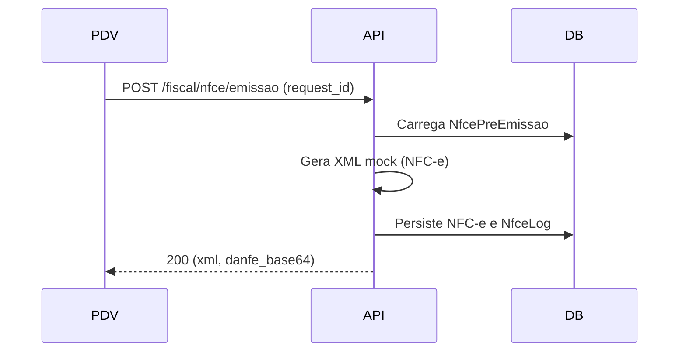
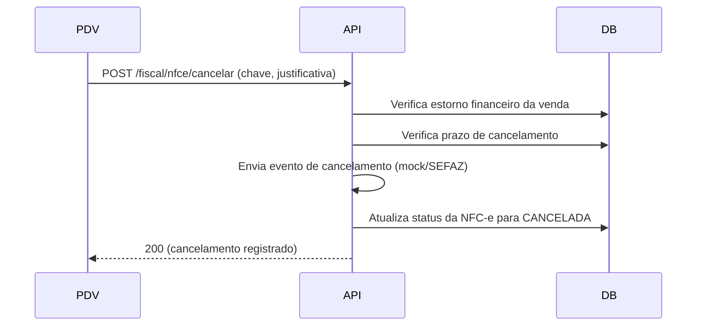
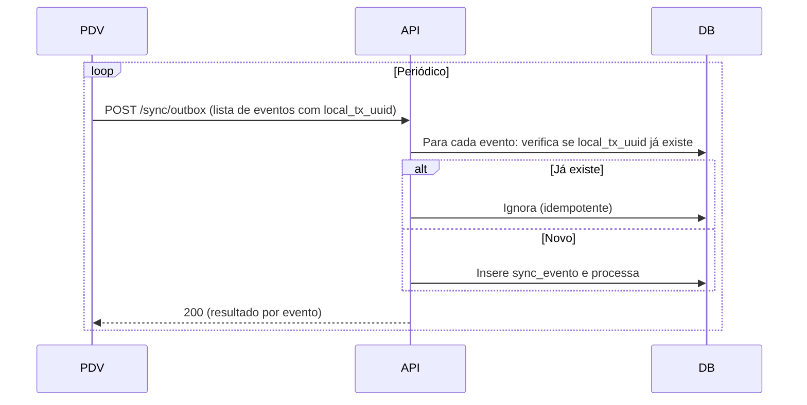

# GetStart PDV — Fluxos Técnicos e Diagramas

## 1. Fluxo de Login

## 2. Fluxo de Reserva de Numeração NFC-e

## 3. Fluxo de Pré-Emissão

## 4. Fluxo de Emissão (Mock)

## 5. Fluxo de Cancelamento

## 6. Fluxo de Sync Offline (Outbox)

